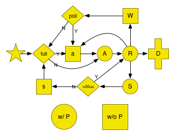

go 1.5 中
结构定义在 [runtime2.go](https://github.com/youngsofun/go/blob/master/src/runtime/runtime2.go#L211) 中,
调度相关在 [proc1.go](https://github.com/youngsofun/go/blob/master/src/runtime/proc1.go)

简单的说：

1. M 是系统线程
2. P是G的容器， \#P = GOMAXPROCS
3. G 被**分组**到某个P中，P被**分配**到M上，P队列头的G在M上执行

稍微复杂点：

1. M上可能没有P（比如syscall）, P也可能闲置(freelist中)
2. G可能换P，P可能换M，当然尽量不换，G可以被lock在M上。
3. G(runnable)可以能在全局队列中，

# 一些特殊的东西
# getg()

* runtime/stubs.go

```
// getg returns the pointer to the current g.
// The compiler rewrites calls to this function into instructions
// that fetch the g directly (from TLS or from the dedicated register).
func getg() *g
```


* [cmd/compile/internal/amd64/ggen.go](https://github.com/youngsofun/go/blob/master/src/cmd/compile/internal/amd64/ggen.go#L729)
	
```
// res = runtime.getg()
func getg(res *gc.Node) {...} // 这里 gc 是go compiler
```

* [cmd/compile/internal/arm64/galign.go](https://github.com/youngsofun/go/blob/master/src/cmd/compile/internal/amd64/galign.go#L101)

```
	gc.Thearch.Getg = getg
```
		

## mutex


* lock_sema.go
	* // +build darwin nacl netbsd openbsd plan9 solaris windows
* lock_futex.go
	* // +build dragonfly freebsd linux


# [M](https://github.com/youngsofun/go/blob/master/src/runtime/runtime2.go#L275)


```
	g0      *g     // goroutine with scheduling stack
	curg          *g       // current running goroutine
	park          note // 停车场
```

```
func newm(fn func(), _p_ *p)      
     newosproc(mp, unsafe.Pointer(mp.g0.stack.hi))
     // newosproc(mp *m, stk unsafe.Pointer)  // os1_linux.go
          clone(cloneFlags, stk, unsafe.Pointer(mp), unsafe.Pointer(mp.g0), unsafe.Pointer(funcPC(mstart)))
          // TEXT runtime·clone(SB),NOSPLIT,$0   // Copy mp, gp, fn off parent stack for use by child
          
```


newm(fn func(), _p_ *p)  特殊，和系统调用fork/clone一样，一跑到他就是"花开两枝，各表一头"。


clone实际跑的是 mstart()：
```
ret := clone(cloneFlags, stk, unsafe.Pointer(mp), unsafe.Pointer(mp.g0), unsafe.Pointer(funcPC(mstart)))
```


 newm()：
```
 	 allocm:
 		 mp.mstartfn = fn 
 	 mp.nextp.set(_p_)
```
这里虽然叫mstartfn，但是实际执行是这样的：

mstart():
```
	if fn := _g_.m.mstartfn; fn != nil {
		fn()
	}
	if _g_.m.helpgc != 0 {
		_g_.m.helpgc = 0
		stopm()
	} else if _g_.m != &m0 {
		acquirep(_g_.m.nextp.ptr())
		_g_.m.nextp = 0
	}
	schedule()
```

* 如果 p == nil， 就可以理解为一般的fork，跑fn , 如sysmon和mhelpgc。
	* 问题来了：  他们不需要P就能跑吗？
		* 对于helpgc，会直接stopm()
		* 而sysmon是一个无限循环
* 否则 就是先跑fn，除了nil就是mspinning， 然后跑p 


	
	
newm 被调用链条：

1. runtime.main() 
	2. newm(sysmon, nil) 	
2. startTheWorldWithSema() 会为每个P启动M，P如果没有带着M，就创建
	3. newm(nil, p)	
	4. newm(mhelpgc, nil)
2. startm() Schedules some M to run the p (creates an M if necessary).
	3. fn = mspinning； newm(fn, _p_) 
	
   * 被调用
   	 * handoffp  // Hands off P from syscall or locked M.    
   	 * wakep
       * ready // g ready to run
       * newproc1  // Create a new g 
       
* 注意一开始执行的是mstart， 另外还有个startm，stopm，
	* mstart()：minit()然后 跑schedule()
	* startm(_p_ *p, spinning bool) ：  
		* Schedules some M to run the p (creates an M if necessary)
			* mp = mget() 或 newm()	
			* notewakeup(&mp.park)
* 没有mstop。clone后"线程"执行结束就是结束了 ( P跑完一个（或一会儿）G 会找下一个，如果找不到，就futex_sleep, 所以最多GOMAXPROCS个物理线程因此 sleep)，但m结构体会放到 idle list 中
	

          
# P 

P 最简单， 重要filed：
	
```
	runq     [256]*g
	mcache      *mcache
// 和 gc 相关
	gcBgMarkWorker   *g
	// gcw is this P's GC work buffer cache. The work buffer is
	// filled by write barriers, drained by mutator assists, and
	// disposed on certain GC state transitions.
	gcw gcWork
```
	
## P的工作：不停的找G，跑之， schedule()：


1. _g_ := getg()
2. 需要trace 一下unblock事件？
3. 跑一下 GCWorker?（前提 gcBlackenEnabled）
4.  globrunqget (schedule每执行61次，跑一下这个)
5. runqget (local)
6. findrunnable() // blocks until work is available
	1. local
	2. global
	3. netpoll(false) // non-blocking
	4. runqsteal //random steal from other P's， 4 x \#P 次
	5. 如果在GC mark phase，参与到并发的mark过程中去
	6. releasep() //  Disassociate p and the current m.
	7. pidleput(_p_) // Put p to on _Pidle list.
	8. 再查一遍
	9. stopm() //Stops execution of the current m until new work is available.
		1. mput()
		2. notesleep
7. execute(gp, inheritTime)

	
## G


```
	stack       stack   // offset known to runtime/cgo
	
	_panic       *_panic // innermost panic 
	_defer         *_defer // innermost defer
	
	m              *m      // current m
	
	sched          gobuf
	syscallsp      uintptr        // if status==Gsyscall, syscallsp = sched.sp to use during gc
	syscallpc      uintptr        // if status==Gsyscall, syscallpc = sched.pc to use during gc
	
	param          unsafe.Pointer // passed parameter on wakeup
	waiting        *sudog // sudog structures this g is waiting on (that have a valid elem ptr)
		
	waitreason     string // if status==Gwaiting
	schedlink      guintptr
	preempt        bool   // preemption signal, duplicates stackguard0 = stackpreempt
	
	preemptscan    bool   // preempted g does scan for gc
	gcscandone     bool   // g has scanned stack; protected by _Gscan bit in status
	gcscanvalid    bool   // false at start of gc cycle, true if G has not run since last scan
	
	throwsplit     bool   // must not split stack


```

### G 的创建

```
// 。。。 The compiler turns a go statement into a call to this.。。。

func newproc(siz int32, fn *funcval) {
	argp := add(unsafe.Pointer(&fn), ptrSize)
	pc := getcallerpc(unsafe.Pointer(&siz))
	systemstack(func() {
		newproc1(fn, (*uint8)(argp), siz, 0, pc)
	})
}
```


### G 调度
P的状态

	_Pidle   
	_Prunning 
	_Psyscall
	_Pgcstop
	_Pdead
	
G 的状态


	_Gidle            = iota // 0
	_Grunnable               // 1 runnable and on a run queue
	_Grunning                // 2
	_Gsyscall                // 3
	_Gwaiting                // 4
	_Gdead                   // 6
	_Genqueue                // 7 Only the Gscanenqueue is used.
	_Gcopystack              // 8 in this state when newstack is moving the stack
	// the following encode that the GC is scanning the stack and what to do when it is done
	
	
	_Gscan = 0x1000 // atomicstatus&~Gscan = the non-scan state,
	_Gscanrunnable = _Gscan + _Grunnable //  0x1001 When scanning completes make Grunnable (it is already on run queue)
	_Gscanrunning  = _Gscan + _Grunning  //  0x1002 Used to tell preemption newstack routine to scan preempted stack.
	_Gscansyscall  = _Gscan + _Gsyscall  //  0x1003 When scanning completes make it Gsyscall
	_Gscanwaiting  = _Gscan + _Gwaiting  //  0x1004 When scanning completes make it Gwaiting
	_Gscanenqueue = _Gscan + _Genqueue //  When scanning completes make it Grunnable and put on runqueue

下图是go1.2时画的：
    



#G
### G分类
* user G
* system G 
	* 常驻
		* m->g0
		* m->gsignal
	* gc... timer
	
	
