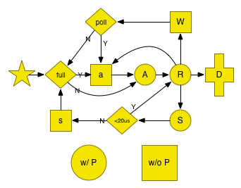

1. 调度谁？即停一个G后跑哪个G? [schedule](#:whoisnext)

     1. [P 状态](#pstats)
     2. [G 状态](#gstats)
	 3. [状态迁移图](#change_graph)
2. [调度时机，即什么时候停、停谁？](#when)
	3. sysmon, 抢占
	4. epoll
	5. syscall
	6. futex (sleep/Lock internal)
	7. chan
	8. syncSema (sync包:mutex, cond..)
	9. timer
9. 


# [调度谁？即停一个G后跑哪个G?](id:whoisnext)

这个简单, 先说

## schedule()：

P的工作就是：不停的找G，跑之


1. _g_ := getg()
2. 需要trace 一下unblock事件？
3. 跑一下 GCWorker?（前提 gcBlackenEnabled）
4.  globrunqget (schedule每执行61次，跑一下这个)
5. runqget (local)
6. findrunnable() // blocks until work is available
	1. local
	2. global
	3. netpoll(false) // non-blocking
	4. runqsteal //random steal from other P's， 4 x \#P 次
	5. 如果在GC mark phase，参与到并发的mark过程中去
	6. releasep() //  Disassociate p and the current m.
	7. pidleput(_p_) // Put p to on _Pidle list.
	8. 再查一遍
	9. stopm() //Stops execution of the current m until new work is available.
		1. mput()
		2. notesleep
7. execute(gp, inheritTime)


# [调度时机，即什么时候停、停谁？](id:when)

1. futex

	sleep/Lock internal
1. blocking syscall
1. netpoll
	
	socket, pipe
1. chan
1. syncSema （count may < 0）
	
	mutex, cond
	rwmutex (write-preferring)
1. timer

1. preemption
	
	syscall block > 20us
	
	running > 10 ms
	


### [P 状态](id:pstats)


	_Pidle   
	_Prunning 
	_Psyscall
	_Pgcstop
	_Pdead

### [G 状态](id:gstats)


	_Gidle            = iota // 0
	_Grunnable               // 1 runnable and on a run queue
	_Grunning                // 2
	_Gsyscall                // 3
	_Gwaiting                // 4
	_Gdead                   // 6
	_Genqueue                // 7 Only the Gscanenqueue is used.
	_Gcopystack              // 8 in this state when newstack is moving the stack
	// the following encode that the GC is scanning the stack and what to do when it is done
	
	
	_Gscan = 0x1000 // atomicstatus&~Gscan = the non-scan state,
	_Gscanrunnable = _Gscan + _Grunnable //  0x1001 When scanning completes make Grunnable (it is already on run queue)
	_Gscanrunning  = _Gscan + _Grunning  //  0x1002 Used to tell preemption newstack routine to scan preempted stack.
	_Gscansyscall  = _Gscan + _Gsyscall  //  0x1003 When scanning completes make it Gsyscall
	_Gscanwaiting  = _Gscan + _Gwaiting  //  0x1004 When scanning completes make it Gwaiting
	_Gscanenqueue = _Gscan + _Genqueue //  When scanning completes make it Grunnable and put on runqueue

### [状态迁移图](id:change_graph)
下图是go1.2时画的：
    


```
A: runnable
R: running
S: syscall
W: waiting
```


## sysmon

1. run every 20 us
1. netpoll every 10ms  （nb）
1. preemption